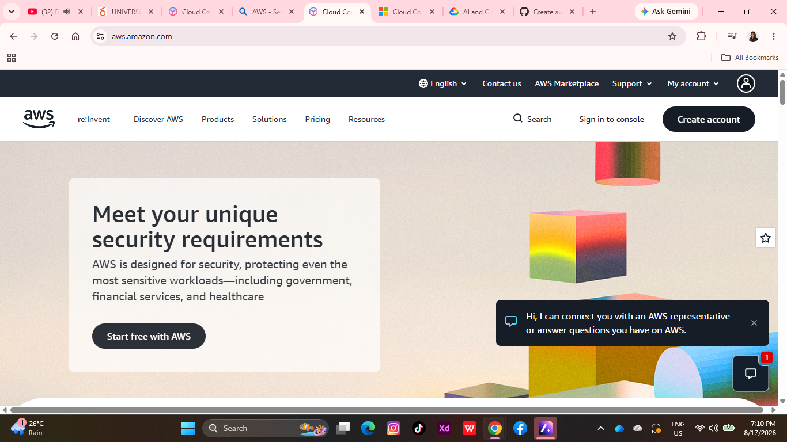

# AWS Research

## Brief Overview

Amazon Web Services (AWS) is a cloud computing platform that provides different services for computing, storage, databases, networking, and security.

## Global Infrastructure

AWS has data centers around the world that are organized into Regions and Availability Zones. This allows businesses to run their applications and store data in different locations.

## Cloud Management Console

The AWS Management Console is a web-based interface used to manage AWS services and resources. Users can create, configure, and monitor their cloud resources through the console.

## Four Core Services

1. Amazon EC2 – provides virtual servers for running applications.
2. Amazon S3 – provides storage for files and other data.
3. Amazon VPC – provides networking for AWS resources.
4. AWS IAM – manages users, permissions, and access.

## Three Advantages

1. AWS offers many different cloud services.
2. It can scale resources based on business needs.
3. It has a large global infrastructure.

## Typical Enterprise Use Cases

AWS can be used for websites, mobile applications, databases, data storage, backups, and enterprise applications.

## Screenshot

